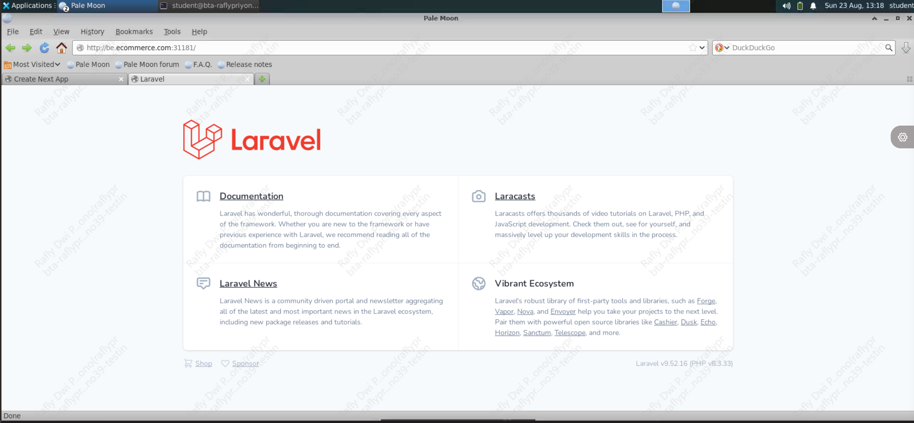
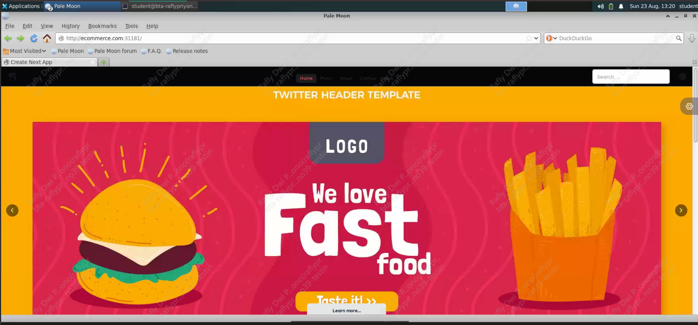

# Challenge-Adinusa

## Instructions

### 1. Build & Push Images
Build the following applications, then push them to your own registry:

- `backend-laravel`
- `frontend-nextjs`

---

### 2. Setup Database
Create Kube object that are available in the `tools` folder (with this order):

1. db-secret.yaml (adjust the value if needed)
2. db-mysql.yaml
3. registry-secret.yaml (insert your registry crendentials)

Notes:
- database using PVC with `storageClassName: local-path` so make sure to install `local-path-provisioner` first (refer to lab 14.5)

### 3. Prepare Backend
Generate APP_KEY for backend by running this command:

```
   docker run --rm your-registry/your-backend-image:tag php artisan key:generate --show
```

Save the output and create a kubernetes secret for backend `backend-secret` (The secret must contain the following keys):
- `APP_KEY` (insert the generated key here)
- `APP_ENV` (up to you)
- `APP_URL` (your Backend domain)
- `FRONTEND_URL` (your frontend domain)
- `DB_HOST` (your database service name)
- `DB_PORT`
- `DB_CONNECTION` (mysql)
---

Run `backend-migrate` job from folder `/tools` (dont forget to adjust the container image)

```
kubectl apply -f backend-migrate.yaml
kubectl wait --for=condition=complete --timeout=120s job/backend-migrate -n ecommerce
kubectl get job backend-migrate -n ecommerce
# wait until COMPLETIONS = 1/1
```

### 3. Backend: Deployment & Service

Create a **Deployment** and **Service** with the following specifications:

- **Port:** `8000`
- **NodePort** `31101`
- **containerPort** `80`
- Give the deployment minimum resource of `100m` CPU and `100Mi` memory. for the limit it is up to you
- Create HPA for backend with `maxReplica` 4,  CPU target 70% and memory target 75%

#### Secret Configuration
If the **backend** application needs database access:

- Use the secret: `db-secret`
- and rename the env secret from `db-secret` to this key `DB_DATABASE`, `DB_USERNAME` and `DB_PASSWORD` as it is expected from backend application

**backend** application also needs several env variable to run:

- Use the secret: `backend-secret` 

#### Backend Application Preview


---

### 4. Frontend: Deployment & Service

Create a **Deployment** and **Service** with the following specifications:

- **Port:** `3000`
- **NodePort** `31102`
- **containerPort:** `3000`
- Give the deployment minimum resource of `100m` CPU and `1024Mi` memory. for the limit it is up to you
- Create HPA for backend with `maxReplica` 4,  CPU target 70% and memory target 75%

#### Secret Configuration
**frontend** application needs several env variable to run, so create secret that contains the following keys :
- **NEXT_PUBLIC_BACKEND_URL** `http://your-backend-service-name.your-namespace.svc.cluster.local:8000/api`
- **API_URL** `http://your-backend-service-name.your-namespace.svc.cluster.local:8000/api`
- **FRONTEND_URL** `http://YOUR-FE-DOMAIN.com`
- **NEXT_PUBLIC_API_URL** `http://YOUR-BE-DOMAIN.com/api`

#### Frontend Application Preview


---

### 6. Expose Applications Using Ingress

Expose the **backend** and **frontend** applications using Kubernetes Ingress with the following domains:

- `YOUR-BE-DOMAIN.com`
- `YOUR-FE-DOMAIN.com`

#### Ingress Requirements

- Create an **Ingress resource** that routes:
  - `YOUR-BE-DOMAIN.com` → `your-backend-service-name`
  - `YOUR-FE-DOMAIN.com` → `your-frontend-service-name`
- Use the appropriate **Ingress Controller** (e.g., NGINX Ingress)
- Configure `/etc/hosts` to point the domains to your Ingress IP for verify web
- use pathType `Prefix` and path `/` for both ingress

Notes:
- the ingress use `ingressClassName: nginx` so make sure to install `Nginx Ingress Controller` first (refer to lab 16.1)

---

## Important Notes

### Flow:
- create the namespace `ecommerce`, ALL the kubernetes object will be placed inside this ns
- Build your backend and frontend image
- Ensure all images are successfully pushed to your image registry before deployment.
- Setup database from folder `/tools`
- Generate APP_KEY by running the backend image and run command `php artisan key:generate`
- Create secret for backend application
- Create secret that contains your private registry creds so the deployment can use it using `imagePullSecrets` (template in folder `/tools`)
- Run `backend-migrate` job from folder `/tools` (dont forget to adjust the container image)
- Create secret for frontend application
- Deploy deployment and service for backend and frontend
- Create ingress for backend and frontend
- Map one of your Node IP to your domain in `/etc/hosts` (you can choose any Node IP)
- Access your app using `http://YOUR-FE-DOMAIN.com:NodePort` , get the NodePort from `ingress-nginx-controller` service
